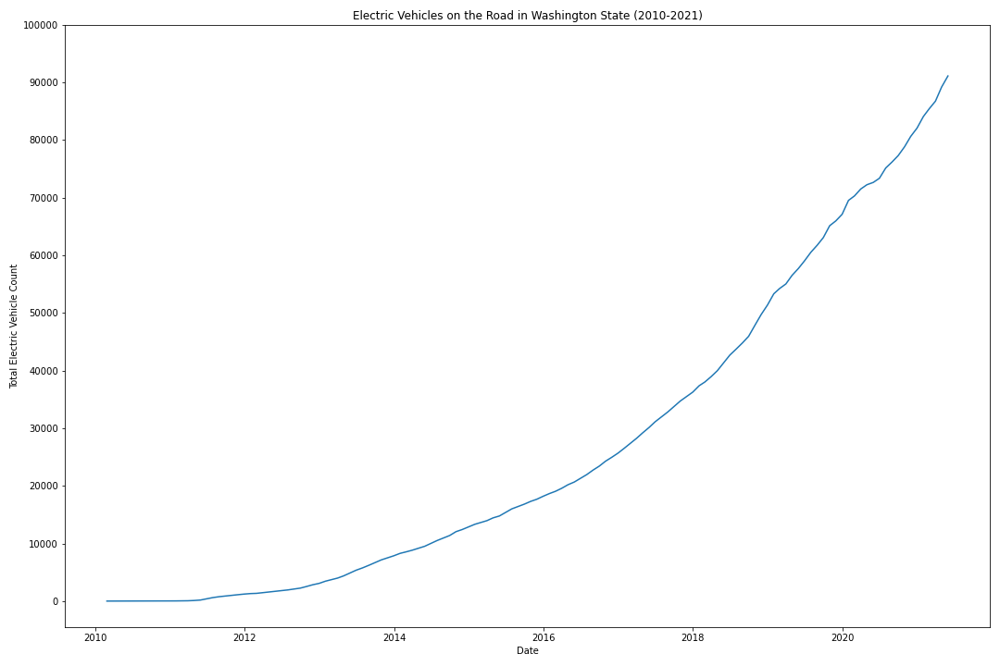
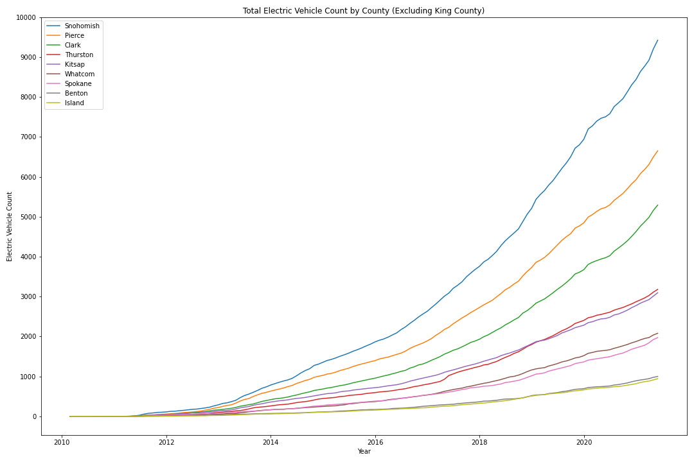
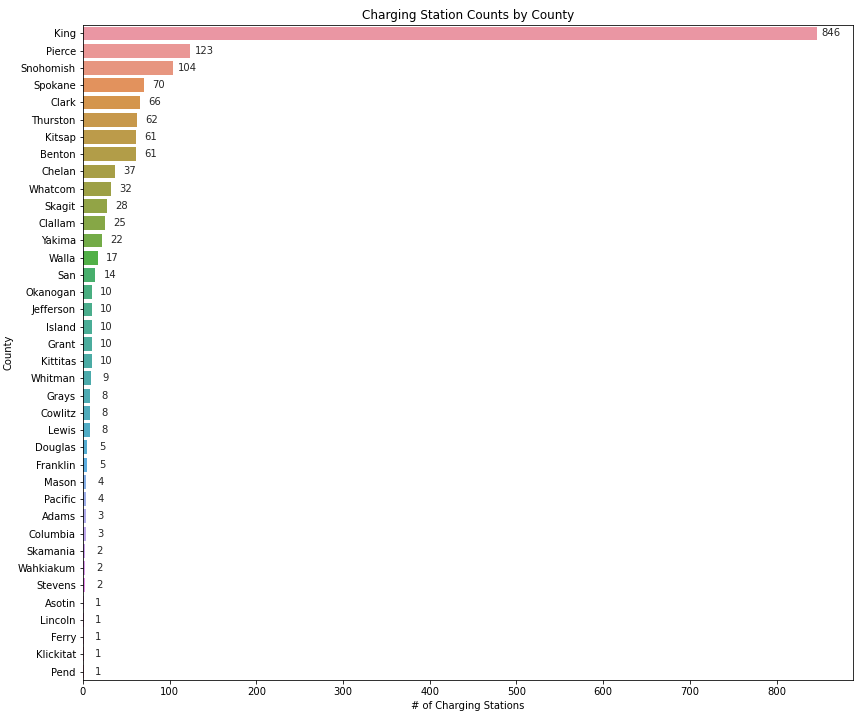

# Leading the Charge: Predicting the Demand for Electric Vehicles and Chargers in Washington State


> Image from: https://energytransition.org/wp-content/uploads/2017/11/Charging_station_MIA_09_2017_5954.jpg

&nbsp;

**For Tableau Dashboard** [click here](https://public.tableau.com/views/ElectricVehiclePredictionsandExistingChargingInfrastructureinWashingtonState/Dashboard1?:language=en-US&publish=yes&:display_count=n&:origin=viz_share_link).


&nbsp;
## Introduction

### Market at a Glance
Climate change, including concerns about rising greenhouse gas emissions, has become an increasingly pressing concern among officials in the United States and around the world over the past several years. According to the U.S. Environmental Protection Agency (EPA), "greenhouse gas (GHG) emissions from transportation account for about 29 percent of total U.S. greenhouse gas emissions, making it the largest contributor of U.S. GHG emissions."[¹](https://www.epa.gov/transportation-air-pollution-and-climate-change/carbon-pollution-transportation) In light of these findings and the research being conducted around this issue, President Joe Biden and his administration are working on passing a [bipartisan infrastructure deal](https://www.whitehouse.gov/briefing-room/statements-releases/2021/06/24/fact-sheet-president-biden-announces-support-for-the-bipartisan-infrastructure-framework/) that would prioritize clean energy and support the development of a nationwide network of electric vehicle chargers.

In addition to large scale policy proposals at the national level, some states are also taking action on their own. For example, both California and Washington are working towards mandating electric vehicles by 2035 and 2030 respectively in an effort to phase out vehicles that use gasoline. Furthermore, within the private sector, several major car manufacturers (such as Ford, GM, Volvo, etc.) have [announced](https://www.caranddriver.com/news/g35562831/ev-plans-automakers-timeline/) that they will be going fully electric in the next decade, which would prove to be a significant change in the auto industry. Taken together, if implemented, these changes in both the public and private sectors would cause a massive increase in demand for electric vehicles (EVs). The question is: how will the current charging infrastructure of these states support an influx in demand for new EVs? 

### Business Case
To be able to achieve a fully electric future and keep up with the demand for chargers, the charging infrastructure has to be expanded. Therefore, the Washington Department of Transportation is planning to spend $8 million on charging infrastructure projects between July 1st, 2021 and June 30, 2023[²](https://wsdot.wa.gov/business/innovative-partnerships/zero-emission-vehicle-infrastructure-partnerships). This is a great business opportunity for EV charging companies. By investing in Washington state, not only would these companies be eligible for government funding, but they would also put themselves in a profitable position as the demand for chargers continues to increase over the coming years. 

### Business Problem & Goal
In order to position these chargers strategically, it is vital to model and predict the demand for electric vehicles in each county in Washington. In an effort to find counties that will have the most demand with the least amount of chargers, this analysis focuses on time series modeling of the amount of electric vehicles in the top 10 counties within Washington with the most purchases of new electric vehicles. Our goal was to recommend top 3 counties to invest in.

&nbsp;

## Data

We used Washington State's API to collect [electric vehicle title and registration activity data](https://data.wa.gov/Transportation/Electric-Vehicle-Title-and-Registration-Activity/rpr4-cgyd) which included a total of 433,172 transactions (91,255 new vehicle transactions). 

Additionally, to be able to compare future EV demand to existing charging infrastructure, we used National Renewable Energy Laboratory's API. The [current charging station data](https://developer.nrel.gov/docs/transportation/alt-fuel-stations-v1/all/) we received from this API had 1,686 charging stations for the state of Washington.

&nbsp;

## Method

After accessing Washington State's API and pulling the information mentioned above, we scrubbed the data and started exploring the dataset to understand each of the columns. We then dropped columns that were not useful for this analysis and removed duplicated transactions for the same vehicles. 

In order to translate the individual title transaction data into electric vehicle counts in each county, we filtered our dataset to keep the "Original Title" transactions. Then we resampled the time series to reflect monthly counts and took the cumulative sum of these numbers.

Using this modified time series data, we worked on Exploratory Data Analysis (EDA) and created visualizations. Then we moved onto modeling.

The modeling process was the same for each county and consisted of seasonal decomposition to check for seasonality and see the trend information. We then split data for each county into training and testing sets. Using the training set, we ran a gridsearch with pmdarima to find the best parameters. After plugging in these parameters into SARIMAX models, we got forecasts for the duration of the test sets and visualized these results to decide whether the model's forecasts were accurate. 

When we found forecasts that were not accurate, we iterated on different train/test splits to inspect the results. Once each model was validated, we proceeded to fit the model to all observed data to get predictions on the future amount of electric vehicles. 

## Results    

### Amount of Electric Vehicles on the Road in Washington State


>As we can see above, the amount of electric vehicles on Washington State roads have been increasing exponentially over the past 10 years. On a high level, this confirms that Washington State has the necessary demand trend for electric vehicles to make investing in it profitable for an EV charging company. 

&nbsp;

### Electric Vehicles on the Road Over Time by County

Now that we looked at the statewide trend, we can start looking at individual counties. Since we have limited time for this analysis, we will be limiting our analysis to the top 10 counties that had the most electric vehicle purchases in the past 10 years.
    


> Here, we can see that out of the top 10 most EV purchasing counties, King County has been growing much faster compared to others. This is expected since King County includes Seattle, which is the largest city by population in Washington State. Due to the scale differences between King County and the other 9 counties, it is difficult to see how these 9 counties compare to each other.

&nbsp;

### Electric Vehicles on the Road Over Time (Excluding King County)
    

    
> When King County is excluded, we can see that Snohomish County is leading the charge in electric vehicle purchases followed by Pierce and Clark County. 

&nbsp;

### Most Purchased Car Models by County

Another important piece of information that can be relevant for an electric charging company is what the most purchased electric vehicle models are in each of these counties to decide on additional factors. These may include: 

- Whether to include adapters for different connector types (Tesla, CCS, CHAdeMO etc.)
- What kind of charging station to build (level 1, level 2, level 3)
- Spacing of chargers based on the size of vehicles


    
> Nissan Leaf and Tesla Model 3 are the most purchased vehicles in each of these counties. Nissan Leaf was released in December 2010 and is widely considered to be the first mass-market electric vehicle. Tesla's Model 3 is a relatively lower priced luxury electric vehicle that was designed to appeal to the mass market as well. Considering these factors, it is not surprising that these vehicles are the most purchased vehicles in each county.

&nbsp;

### Current Charging Station Counts by County



> Above, we can see that King County has by far the most amount of chargers compared to other counties followed by Pierce and Snohomish. Refer to Appendix B for more information.

&nbsp;

## Conclusions 

To sum up, the momentum behind electric vehicles - generated by the recent advancements in technology and policy - makes today an ideal time to invest in charging infrastructure. As one of the states that is leading the charge in electrifying transportation, Washington State is one of the best places in the United States to build new charging stations. Below are our takeaways and recommendations:

&nbsp;

- The electric vehicle counts in each county have been increasing exponentially for the past 10 years. Our models predicted that this trend will continue for at least the next few years. 

- Nissan Leaf and Tesla Model 3 were the most preferred electric vehicles in each county.

- King County has the most amount of chargers followed by Pierce County.

&nbsp;

### Comparison of Counties
<div>

<table border="1" class="dataframe">
  <thead>
    <tr style="text-align: right;">
      <th></th>
      <th>EV Count for 2021-05-31</th>
      <th>EV Prediction for 2023-08-31</th>
      <th>Existing Charger Count</th>
      <th>Chargers per EV</th>
      <th>EVs per Charger</th>
      <th>EVs Added (Today-2023)</th>
    </tr>
    <tr>
      <th>County</th>
      <th></th>
      <th></th>
      <th></th>
      <th></th>
      <th></th>
      <th></th>
    </tr>
  </thead>
  <tbody>
    <tr>
      <th>Island</th>
      <td>943.0</td>
      <td>1855.0</td>
      <td>10.0</td>
      <td>0.005</td>
      <td>186.0</td>
      <td>912.0</td>
    </tr>
    <tr>
      <th>Clark</th>
      <td>5294.0</td>
      <td>11887.0</td>
      <td>66.0</td>
      <td>0.006</td>
      <td>180.0</td>
      <td>6593.0</td>
    </tr>
    <tr>
      <th>Snohomish</th>
      <td>9423.0</td>
      <td>17117.0</td>
      <td>104.0</td>
      <td>0.006</td>
      <td>165.0</td>
      <td>7694.0</td>
    </tr>
    <tr>
      <th>Whatcom</th>
      <td>2081.0</td>
      <td>3122.0</td>
      <td>32.0</td>
      <td>0.010</td>
      <td>98.0</td>
      <td>1041.0</td>
    </tr>
    <tr>
      <th>Pierce</th>
      <td>6652.0</td>
      <td>11407.0</td>
      <td>123.0</td>
      <td>0.011</td>
      <td>93.0</td>
      <td>4755.0</td>
    </tr>
    <tr>
      <th>Kitsap</th>
      <td>3097.0</td>
      <td>5653.0</td>
      <td>61.0</td>
      <td>0.011</td>
      <td>93.0</td>
      <td>2556.0</td>
    </tr>
    <tr>
      <th>King</th>
      <td>51209.0</td>
      <td>74875.0</td>
      <td>846.0</td>
      <td>0.011</td>
      <td>89.0</td>
      <td>23666.0</td>
    </tr>
    <tr>
      <th>Thurston</th>
      <td>3181.0</td>
      <td>5299.0</td>
      <td>62.0</td>
      <td>0.012</td>
      <td>85.0</td>
      <td>2118.0</td>
    </tr>
    <tr>
      <th>Spokane</th>
      <td>1973.0</td>
      <td>3507.0</td>
      <td>70.0</td>
      <td>0.020</td>
      <td>50.0</td>
      <td>1534.0</td>
    </tr>
    <tr>
      <th>Benton</th>
      <td>1000.0</td>
      <td>1820.0</td>
      <td>61.0</td>
      <td>0.034</td>
      <td>30.0</td>
      <td>820.0</td>
    </tr>
  </tbody>
</table>
</div>

&nbsp;

## Recommendations

As discussed in the final notebook, there are many factors at play when trying to find the optimum locations for EV charging stations. Based on our discussion of these factors in the notebook, the EVs per Charger ratios and predictions on the electrical vehicle counts in each county for August, 2023, we believe that the following counties have great potential in being highly profitable for an electric vehicle charging company:

**1.** Clark County

**2.** Snohomish County

**3.** Whatcom County

Therefore, we recommend electric vehicle charging companies invest in these counties. Please refer to the notebook for more information. 

&nbsp;

### Electric Vehicle Predictions for Clark, Snohomish and Whatcom Counties
    


## Limitations & Next Steps

Due to time limitations, we had to limit the modeling exercise to 10 counties out of the 39 counties that are located in Washington State. Even though we took the top 10 counties with the most electric vehicle purchase transactions, there may be other counties that are promising for future electric vehicle demand. In the future, we would like to model the electric vehicle counts for all counties in Washington to have a more comprehensive analysis.

Furthermore, conducting an analysis at both the city and zipcode level could be fruitful. As discussed in the Interpret section, there are many factors that may affect the success of an electric vehicle charging station. To be able to account for these factors and inform decisions regarding the exact locations of the electric vehicle chargers, looking at the data on a city or even zipcode level would be necessary.

Additionally, we used the "Original Title" transactions to infer the amount of electric vehicles on the road in each county. The "Transfer Title" transactions could have revealed more information about the used electric vehicle market and provided us with a more holistic picture of the demand for electric vehicles and chargers. For example, if people in a growing county are mainly purchasing used electric vehicles, it can still be a great county to invest in for an EV charging company. As one of our next steps, we would like to incorporate the used car transactions into our analysis and keep track of these cars as they move from one county to the next (deducting them from the vehicle count in the originating county and adding them to the new county).

We think that analyzing the commuting patterns of residents in each county could help put this information into context. As we discussed above, most charging is done at home or at work. Finding counties that people tend to commute into for work, and accounting for this effect by adjusting the anticipated demand for chargers in these counties would result in more accurate recommendations.

Lastly, expanding the scope of this analysis to other states and other countries can further help EV charging companies looking to grow their charging network on a national and global scale.

&nbsp;

## For More Information

Please review my full analysis in [my Jupyter Notebook](./final_notebook.ipynb) or my [presentation](./presentation.pdf). For any additional questions, please contact Berke Tezcan at berketezcan@gmail.com.

&nbsp;
### Repository Structure
```
├── README.md               <- The top-level README for reviewers of this project.
├── final_notebook.ipynb    <- Narrative documentation of analysis in jupyter notebook
├── notebook.pdf            <- Narrative documentation of analysis in PDF
├── presentation.pdf        <- PDF version of project presentation
├── images                  <- Both sourced externally and generated from code
└── data                    <- Externally sourced data
```

## Appendix A: Monthly Electric Vehicle Count Predictions for Each County

### King County

<div>
<table border="1" class="dataframe">
  <thead>
    <tr style="text-align: right;">
      <th></th>
      <th>Lower Confidence Interval</th>
      <th>Upper Confidence Interval</th>
      <th>Predictions</th>
    </tr>
  </thead>
  <tbody>
    <tr>
      <th>2021-06-30</th>
      <td>51570.0</td>
      <td>52346.0</td>
      <td>51958.0</td>
    </tr>
    <tr>
      <th>2021-07-31</th>
      <td>52468.0</td>
      <td>53860.0</td>
      <td>53164.0</td>
    </tr>
    <tr>
      <th>2021-08-31</th>
      <td>52845.0</td>
      <td>54780.0</td>
      <td>53812.0</td>
    </tr>
    <tr>
      <th>2021-09-30</th>
      <td>53232.0</td>
      <td>55643.0</td>
      <td>54438.0</td>
    </tr>
    <tr>
      <th>2021-10-31</th>
      <td>53867.0</td>
      <td>56696.0</td>
      <td>55282.0</td>
    </tr>
    <tr>
      <th>2021-11-30</th>
      <td>54697.0</td>
      <td>57901.0</td>
      <td>56299.0</td>
    </tr>
    <tr>
      <th>2021-12-31</th>
      <td>55271.0</td>
      <td>58815.0</td>
      <td>57043.0</td>
    </tr>
    <tr>
      <th>2022-01-31</th>
      <td>56241.0</td>
      <td>60098.0</td>
      <td>58170.0</td>
    </tr>
    <tr>
      <th>2022-02-28</th>
      <td>56785.0</td>
      <td>60931.0</td>
      <td>58858.0</td>
    </tr>
    <tr>
      <th>2022-03-31</th>
      <td>57321.0</td>
      <td>61739.0</td>
      <td>59530.0</td>
    </tr>
    <tr>
      <th>2022-04-30</th>
      <td>58421.0</td>
      <td>63095.0</td>
      <td>60758.0</td>
    </tr>
    <tr>
      <th>2022-05-31</th>
      <td>59282.0</td>
      <td>64198.0</td>
      <td>61740.0</td>
    </tr>
    <tr>
      <th>2022-06-30</th>
      <td>59775.0</td>
      <td>65203.0</td>
      <td>62489.0</td>
    </tr>
    <tr>
      <th>2022-07-31</th>
      <td>60668.0</td>
      <td>66723.0</td>
      <td>63695.0</td>
    </tr>
    <tr>
      <th>2022-08-31</th>
      <td>60993.0</td>
      <td>67694.0</td>
      <td>64344.0</td>
    </tr>
    <tr>
      <th>2022-09-30</th>
      <td>61306.0</td>
      <td>68632.0</td>
      <td>64969.0</td>
    </tr>
    <tr>
      <th>2022-10-31</th>
      <td>61853.0</td>
      <td>69773.0</td>
      <td>65813.0</td>
    </tr>
    <tr>
      <th>2022-11-30</th>
      <td>62591.0</td>
      <td>71070.0</td>
      <td>66831.0</td>
    </tr>
    <tr>
      <th>2022-12-31</th>
      <td>63070.0</td>
      <td>72078.0</td>
      <td>67574.0</td>
    </tr>
    <tr>
      <th>2023-01-31</th>
      <td>63946.0</td>
      <td>73456.0</td>
      <td>68701.0</td>
    </tr>
    <tr>
      <th>2023-02-28</th>
      <td>64396.0</td>
      <td>74382.0</td>
      <td>69389.0</td>
    </tr>
    <tr>
      <th>2023-03-31</th>
      <td>64840.0</td>
      <td>75282.0</td>
      <td>70061.0</td>
    </tr>
    <tr>
      <th>2023-04-30</th>
      <td>65850.0</td>
      <td>76728.0</td>
      <td>71289.0</td>
    </tr>
    <tr>
      <th>2023-05-31</th>
      <td>66622.0</td>
      <td>77921.0</td>
      <td>72271.0</td>
    </tr>
    <tr>
      <th>2023-06-30</th>
      <td>67056.0</td>
      <td>78985.0</td>
      <td>73020.0</td>
    </tr>
    <tr>
      <th>2023-07-31</th>
      <td>67902.0</td>
      <td>80551.0</td>
      <td>74227.0</td>
    </tr>
    <tr>
      <th>2023-08-31</th>
      <td>68179.0</td>
      <td>81570.0</td>
      <td>74875.0</td>
    </tr>
  </tbody>
</table>
</div>

&nbsp;

### Snohomish County

<div>
<table border="1" class="dataframe">
  <thead>
    <tr style="text-align: right;">
      <th></th>
      <th>Lower Confidence Interval</th>
      <th>Upper Confidence Interval</th>
      <th>Predictions</th>
    </tr>
  </thead>
  <tbody>
    <tr>
      <th>2021-06-30</th>
      <td>9573.0</td>
      <td>9695.0</td>
      <td>9634.0</td>
    </tr>
    <tr>
      <th>2021-07-31</th>
      <td>9774.0</td>
      <td>9980.0</td>
      <td>9877.0</td>
    </tr>
    <tr>
      <th>2021-08-31</th>
      <td>9948.0</td>
      <td>10244.0</td>
      <td>10096.0</td>
    </tr>
    <tr>
      <th>2021-09-30</th>
      <td>10125.0</td>
      <td>10517.0</td>
      <td>10321.0</td>
    </tr>
    <tr>
      <th>2021-10-31</th>
      <td>10330.0</td>
      <td>10826.0</td>
      <td>10578.0</td>
    </tr>
    <tr>
      <th>2021-11-30</th>
      <td>10520.0</td>
      <td>11128.0</td>
      <td>10824.0</td>
    </tr>
    <tr>
      <th>2021-12-31</th>
      <td>10703.0</td>
      <td>11430.0</td>
      <td>11067.0</td>
    </tr>
    <tr>
      <th>2022-01-31</th>
      <td>10919.0</td>
      <td>11772.0</td>
      <td>11346.0</td>
    </tr>
    <tr>
      <th>2022-02-28</th>
      <td>11088.0</td>
      <td>12075.0</td>
      <td>11582.0</td>
    </tr>
    <tr>
      <th>2022-03-31</th>
      <td>11270.0</td>
      <td>12397.0</td>
      <td>11834.0</td>
    </tr>
    <tr>
      <th>2022-04-30</th>
      <td>11482.0</td>
      <td>12758.0</td>
      <td>12120.0</td>
    </tr>
    <tr>
      <th>2022-05-31</th>
      <td>11675.0</td>
      <td>13104.0</td>
      <td>12389.0</td>
    </tr>
    <tr>
      <th>2022-06-30</th>
      <td>11859.0</td>
      <td>13466.0</td>
      <td>12663.0</td>
    </tr>
    <tr>
      <th>2022-07-31</th>
      <td>12061.0</td>
      <td>13856.0</td>
      <td>12959.0</td>
    </tr>
    <tr>
      <th>2022-08-31</th>
      <td>12245.0</td>
      <td>14237.0</td>
      <td>13241.0</td>
    </tr>
    <tr>
      <th>2022-09-30</th>
      <td>12429.0</td>
      <td>14629.0</td>
      <td>13529.0</td>
    </tr>
    <tr>
      <th>2022-10-31</th>
      <td>12631.0</td>
      <td>15048.0</td>
      <td>13840.0</td>
    </tr>
    <tr>
      <th>2022-11-30</th>
      <td>12824.0</td>
      <td>15467.0</td>
      <td>14145.0</td>
    </tr>
    <tr>
      <th>2022-12-31</th>
      <td>13011.0</td>
      <td>15890.0</td>
      <td>14450.0</td>
    </tr>
    <tr>
      <th>2023-01-31</th>
      <td>13220.0</td>
      <td>16343.0</td>
      <td>14781.0</td>
    </tr>
    <tr>
      <th>2023-02-28</th>
      <td>13399.0</td>
      <td>16774.0</td>
      <td>15086.0</td>
    </tr>
    <tr>
      <th>2023-03-31</th>
      <td>13585.0</td>
      <td>17222.0</td>
      <td>15404.0</td>
    </tr>
    <tr>
      <th>2023-04-30</th>
      <td>13791.0</td>
      <td>17699.0</td>
      <td>15745.0</td>
    </tr>
    <tr>
      <th>2023-05-31</th>
      <td>13984.0</td>
      <td>18171.0</td>
      <td>16078.0</td>
    </tr>
    <tr>
      <th>2023-06-30</th>
      <td>14174.0</td>
      <td>18657.0</td>
      <td>16415.0</td>
    </tr>
    <tr>
      <th>2023-07-31</th>
      <td>14374.0</td>
      <td>19165.0</td>
      <td>16770.0</td>
    </tr>
    <tr>
      <th>2023-08-31</th>
      <td>14563.0</td>
      <td>19671.0</td>
      <td>17117.0</td>
    </tr>
    <tr>
      <th>2023-09-30</th>
      <td>14752.0</td>
      <td>20189.0</td>
      <td>17471.0</td>
    </tr>
    <tr>
      <th>2023-10-31</th>
      <td>14953.0</td>
      <td>20729.0</td>
      <td>17841.0</td>
    </tr>
    <tr>
      <th>2023-11-30</th>
      <td>15148.0</td>
      <td>21273.0</td>
      <td>18210.0</td>
    </tr>
    <tr>
      <th>2023-12-31</th>
      <td>15339.0</td>
      <td>21824.0</td>
      <td>18582.0</td>
    </tr>
    <tr>
      <th>2024-01-31</th>
      <td>15544.0</td>
      <td>22400.0</td>
      <td>18972.0</td>
    </tr>
    <tr>
      <th>2024-02-29</th>
      <td>15730.0</td>
      <td>22966.0</td>
      <td>19348.0</td>
    </tr>
    <tr>
      <th>2024-03-31</th>
      <td>15920.0</td>
      <td>23548.0</td>
      <td>19734.0</td>
    </tr>
  </tbody>
</table>
</div>

&nbsp;

### Pierce County

<div>
<table border="1" class="dataframe">
  <thead>
    <tr style="text-align: right;">
      <th></th>
      <th>Lower Confidence Interval</th>
      <th>Upper Confidence Interval</th>
      <th>Predictions</th>
    </tr>
  </thead>
  <tbody>
    <tr>
      <th>2021-06-30</th>
      <td>6783.0</td>
      <td>6851.0</td>
      <td>6817.0</td>
    </tr>
    <tr>
      <th>2021-07-31</th>
      <td>6923.0</td>
      <td>7042.0</td>
      <td>6982.0</td>
    </tr>
    <tr>
      <th>2021-08-31</th>
      <td>7057.0</td>
      <td>7227.0</td>
      <td>7142.0</td>
    </tr>
    <tr>
      <th>2021-09-30</th>
      <td>7169.0</td>
      <td>7388.0</td>
      <td>7278.0</td>
    </tr>
    <tr>
      <th>2021-10-31</th>
      <td>7332.0</td>
      <td>7600.0</td>
      <td>7466.0</td>
    </tr>
    <tr>
      <th>2021-11-30</th>
      <td>7453.0</td>
      <td>7769.0</td>
      <td>7611.0</td>
    </tr>
    <tr>
      <th>2021-12-31</th>
      <td>7571.0</td>
      <td>7935.0</td>
      <td>7753.0</td>
    </tr>
    <tr>
      <th>2022-01-31</th>
      <td>7743.0</td>
      <td>8153.0</td>
      <td>7948.0</td>
    </tr>
    <tr>
      <th>2022-02-28</th>
      <td>7840.0</td>
      <td>8294.0</td>
      <td>8067.0</td>
    </tr>
    <tr>
      <th>2022-03-31</th>
      <td>7960.0</td>
      <td>8459.0</td>
      <td>8209.0</td>
    </tr>
    <tr>
      <th>2022-04-30</th>
      <td>8118.0</td>
      <td>8660.0</td>
      <td>8389.0</td>
    </tr>
    <tr>
      <th>2022-05-31</th>
      <td>8255.0</td>
      <td>8838.0</td>
      <td>8546.0</td>
    </tr>
    <tr>
      <th>2022-06-30</th>
      <td>8411.0</td>
      <td>9042.0</td>
      <td>8727.0</td>
    </tr>
    <tr>
      <th>2022-07-31</th>
      <td>8571.0</td>
      <td>9252.0</td>
      <td>8912.0</td>
    </tr>
    <tr>
      <th>2022-08-31</th>
      <td>8727.0</td>
      <td>9458.0</td>
      <td>9093.0</td>
    </tr>
    <tr>
      <th>2022-09-30</th>
      <td>8856.0</td>
      <td>9637.0</td>
      <td>9246.0</td>
    </tr>
    <tr>
      <th>2022-10-31</th>
      <td>9051.0</td>
      <td>9880.0</td>
      <td>9465.0</td>
    </tr>
    <tr>
      <th>2022-11-30</th>
      <td>9194.0</td>
      <td>10072.0</td>
      <td>9633.0</td>
    </tr>
    <tr>
      <th>2022-12-31</th>
      <td>9337.0</td>
      <td>10262.0</td>
      <td>9800.0</td>
    </tr>
    <tr>
      <th>2023-01-31</th>
      <td>9546.0</td>
      <td>10517.0</td>
      <td>10031.0</td>
    </tr>
    <tr>
      <th>2023-02-28</th>
      <td>9663.0</td>
      <td>10680.0</td>
      <td>10172.0</td>
    </tr>
    <tr>
      <th>2023-03-31</th>
      <td>9810.0</td>
      <td>10871.0</td>
      <td>10341.0</td>
    </tr>
    <tr>
      <th>2023-04-30</th>
      <td>10005.0</td>
      <td>11109.0</td>
      <td>10557.0</td>
    </tr>
    <tr>
      <th>2023-05-31</th>
      <td>10173.0</td>
      <td>11320.0</td>
      <td>10746.0</td>
    </tr>
    <tr>
      <th>2023-06-30</th>
      <td>10366.0</td>
      <td>11562.0</td>
      <td>10964.0</td>
    </tr>
    <tr>
      <th>2023-07-31</th>
      <td>10565.0</td>
      <td>11811.0</td>
      <td>11188.0</td>
    </tr>
    <tr>
      <th>2023-08-31</th>
      <td>10759.0</td>
      <td>12056.0</td>
      <td>11407.0</td>
    </tr>
    <tr>
      <th>2023-09-30</th>
      <td>10920.0</td>
      <td>12268.0</td>
      <td>11594.0</td>
    </tr>
    <tr>
      <th>2023-10-31</th>
      <td>11161.0</td>
      <td>12560.0</td>
      <td>11861.0</td>
    </tr>
    <tr>
      <th>2023-11-30</th>
      <td>11340.0</td>
      <td>12790.0</td>
      <td>12065.0</td>
    </tr>
    <tr>
      <th>2023-12-31</th>
      <td>11518.0</td>
      <td>13018.0</td>
      <td>12268.0</td>
    </tr>
    <tr>
      <th>2024-01-31</th>
      <td>11776.0</td>
      <td>13326.0</td>
      <td>12551.0</td>
    </tr>
    <tr>
      <th>2024-02-29</th>
      <td>11922.0</td>
      <td>13521.0</td>
      <td>12722.0</td>
    </tr>
    <tr>
      <th>2024-03-31</th>
      <td>12105.0</td>
      <td>13752.0</td>
      <td>12928.0</td>
    </tr>
  </tbody>
</table>
</div>

&nbsp;

### Clark County

<div>
<table border="1" class="dataframe">
  <thead>
    <tr style="text-align: right;">
      <th></th>
      <th>Lower Confidence Interval</th>
      <th>Upper Confidence Interval</th>
      <th>Predictions</th>
    </tr>
  </thead>
  <tbody>
    <tr>
      <th>2021-06-30</th>
      <td>5404.0</td>
      <td>5466.0</td>
      <td>5435.0</td>
    </tr>
    <tr>
      <th>2021-07-31</th>
      <td>5550.0</td>
      <td>5661.0</td>
      <td>5605.0</td>
    </tr>
    <tr>
      <th>2021-08-31</th>
      <td>5685.0</td>
      <td>5846.0</td>
      <td>5766.0</td>
    </tr>
    <tr>
      <th>2021-09-30</th>
      <td>5824.0</td>
      <td>6038.0</td>
      <td>5931.0</td>
    </tr>
    <tr>
      <th>2021-10-31</th>
      <td>5969.0</td>
      <td>6240.0</td>
      <td>6105.0</td>
    </tr>
    <tr>
      <th>2021-11-30</th>
      <td>6122.0</td>
      <td>6455.0</td>
      <td>6288.0</td>
    </tr>
    <tr>
      <th>2021-12-31</th>
      <td>6282.0</td>
      <td>6680.0</td>
      <td>6481.0</td>
    </tr>
    <tr>
      <th>2022-01-31</th>
      <td>6449.0</td>
      <td>6919.0</td>
      <td>6684.0</td>
    </tr>
    <tr>
      <th>2022-02-28</th>
      <td>6604.0</td>
      <td>7149.0</td>
      <td>6877.0</td>
    </tr>
    <tr>
      <th>2022-03-31</th>
      <td>6768.0</td>
      <td>7393.0</td>
      <td>7081.0</td>
    </tr>
    <tr>
      <th>2022-04-30</th>
      <td>6956.0</td>
      <td>7666.0</td>
      <td>7311.0</td>
    </tr>
    <tr>
      <th>2022-05-31</th>
      <td>7132.0</td>
      <td>7932.0</td>
      <td>7532.0</td>
    </tr>
    <tr>
      <th>2022-06-30</th>
      <td>7307.0</td>
      <td>8212.0</td>
      <td>7759.0</td>
    </tr>
    <tr>
      <th>2022-07-31</th>
      <td>7494.0</td>
      <td>8514.0</td>
      <td>8004.0</td>
    </tr>
    <tr>
      <th>2022-08-31</th>
      <td>7678.0</td>
      <td>8821.0</td>
      <td>8249.0</td>
    </tr>
    <tr>
      <th>2022-09-30</th>
      <td>7867.0</td>
      <td>9138.0</td>
      <td>8502.0</td>
    </tr>
    <tr>
      <th>2022-10-31</th>
      <td>8060.0</td>
      <td>9468.0</td>
      <td>8764.0</td>
    </tr>
    <tr>
      <th>2022-11-30</th>
      <td>8260.0</td>
      <td>9812.0</td>
      <td>9036.0</td>
    </tr>
    <tr>
      <th>2022-12-31</th>
      <td>8465.0</td>
      <td>10169.0</td>
      <td>9317.0</td>
    </tr>
    <tr>
      <th>2023-01-31</th>
      <td>8676.0</td>
      <td>10539.0</td>
      <td>9608.0</td>
    </tr>
    <tr>
      <th>2023-02-28</th>
      <td>8887.0</td>
      <td>10916.0</td>
      <td>9901.0</td>
    </tr>
    <tr>
      <th>2023-03-31</th>
      <td>9103.0</td>
      <td>11307.0</td>
      <td>10205.0</td>
    </tr>
    <tr>
      <th>2023-04-30</th>
      <td>9334.0</td>
      <td>11719.0</td>
      <td>10526.0</td>
    </tr>
    <tr>
      <th>2023-05-31</th>
      <td>9563.0</td>
      <td>12138.0</td>
      <td>10850.0</td>
    </tr>
    <tr>
      <th>2023-06-30</th>
      <td>9796.0</td>
      <td>12573.0</td>
      <td>11184.0</td>
    </tr>
    <tr>
      <th>2023-07-31</th>
      <td>10038.0</td>
      <td>13026.0</td>
      <td>11532.0</td>
    </tr>
    <tr>
      <th>2023-08-31</th>
      <td>10283.0</td>
      <td>13492.0</td>
      <td>11887.0</td>
    </tr>
    <tr>
      <th>2023-09-30</th>
      <td>10533.0</td>
      <td>13973.0</td>
      <td>12253.0</td>
    </tr>
    <tr>
      <th>2023-10-31</th>
      <td>10791.0</td>
      <td>14471.0</td>
      <td>12631.0</td>
    </tr>
    <tr>
      <th>2023-11-30</th>
      <td>11055.0</td>
      <td>14985.0</td>
      <td>13020.0</td>
    </tr>
    <tr>
      <th>2023-12-31</th>
      <td>11326.0</td>
      <td>15517.0</td>
      <td>13421.0</td>
    </tr>
    <tr>
      <th>2024-01-31</th>
      <td>11605.0</td>
      <td>16066.0</td>
      <td>13835.0</td>
    </tr>
    <tr>
      <th>2024-02-29</th>
      <td>11888.0</td>
      <td>16630.0</td>
      <td>14259.0</td>
    </tr>
    <tr>
      <th>2024-03-31</th>
      <td>12179.0</td>
      <td>17213.0</td>
      <td>14696.0</td>
    </tr>
  </tbody>
</table>
</div>

&nbsp;

### Thurston County

<div>
<table border="1" class="dataframe">
  <thead>
    <tr style="text-align: right;">
      <th></th>
      <th>Lower Confidence Interval</th>
      <th>Upper Confidence Interval</th>
      <th>Predictions</th>
    </tr>
  </thead>
  <tbody>
    <tr>
      <th>2021-06-30</th>
      <td>3228.0</td>
      <td>3272.0</td>
      <td>3250.0</td>
    </tr>
    <tr>
      <th>2021-07-31</th>
      <td>3284.0</td>
      <td>3362.0</td>
      <td>3323.0</td>
    </tr>
    <tr>
      <th>2021-08-31</th>
      <td>3336.0</td>
      <td>3451.0</td>
      <td>3393.0</td>
    </tr>
    <tr>
      <th>2021-09-30</th>
      <td>3385.0</td>
      <td>3542.0</td>
      <td>3464.0</td>
    </tr>
    <tr>
      <th>2021-10-31</th>
      <td>3436.0</td>
      <td>3638.0</td>
      <td>3537.0</td>
    </tr>
    <tr>
      <th>2021-11-30</th>
      <td>3484.0</td>
      <td>3734.0</td>
      <td>3609.0</td>
    </tr>
    <tr>
      <th>2021-12-31</th>
      <td>3533.0</td>
      <td>3835.0</td>
      <td>3684.0</td>
    </tr>
    <tr>
      <th>2022-01-31</th>
      <td>3580.0</td>
      <td>3936.0</td>
      <td>3758.0</td>
    </tr>
    <tr>
      <th>2022-02-28</th>
      <td>3625.0</td>
      <td>4039.0</td>
      <td>3832.0</td>
    </tr>
    <tr>
      <th>2022-03-31</th>
      <td>3672.0</td>
      <td>4147.0</td>
      <td>3909.0</td>
    </tr>
    <tr>
      <th>2022-04-30</th>
      <td>3720.0</td>
      <td>4259.0</td>
      <td>3990.0</td>
    </tr>
    <tr>
      <th>2022-05-31</th>
      <td>3766.0</td>
      <td>4371.0</td>
      <td>4068.0</td>
    </tr>
    <tr>
      <th>2022-06-30</th>
      <td>3809.0</td>
      <td>4486.0</td>
      <td>4147.0</td>
    </tr>
    <tr>
      <th>2022-07-31</th>
      <td>3851.0</td>
      <td>4603.0</td>
      <td>4227.0</td>
    </tr>
    <tr>
      <th>2022-08-31</th>
      <td>3891.0</td>
      <td>4723.0</td>
      <td>4307.0</td>
    </tr>
    <tr>
      <th>2022-09-30</th>
      <td>3930.0</td>
      <td>4844.0</td>
      <td>4387.0</td>
    </tr>
    <tr>
      <th>2022-10-31</th>
      <td>3968.0</td>
      <td>4967.0</td>
      <td>4468.0</td>
    </tr>
    <tr>
      <th>2022-11-30</th>
      <td>4005.0</td>
      <td>5092.0</td>
      <td>4549.0</td>
    </tr>
    <tr>
      <th>2022-12-31</th>
      <td>4041.0</td>
      <td>5220.0</td>
      <td>4630.0</td>
    </tr>
    <tr>
      <th>2023-01-31</th>
      <td>4076.0</td>
      <td>5349.0</td>
      <td>4712.0</td>
    </tr>
    <tr>
      <th>2023-02-28</th>
      <td>4109.0</td>
      <td>5479.0</td>
      <td>4794.0</td>
    </tr>
    <tr>
      <th>2023-03-31</th>
      <td>4142.0</td>
      <td>5612.0</td>
      <td>4877.0</td>
    </tr>
    <tr>
      <th>2023-04-30</th>
      <td>4175.0</td>
      <td>5747.0</td>
      <td>4961.0</td>
    </tr>
    <tr>
      <th>2023-05-31</th>
      <td>4207.0</td>
      <td>5883.0</td>
      <td>5045.0</td>
    </tr>
    <tr>
      <th>2023-06-30</th>
      <td>4237.0</td>
      <td>6022.0</td>
      <td>5129.0</td>
    </tr>
    <tr>
      <th>2023-07-31</th>
      <td>4266.0</td>
      <td>6162.0</td>
      <td>5214.0</td>
    </tr>
    <tr>
      <th>2023-08-31</th>
      <td>4294.0</td>
      <td>6303.0</td>
      <td>5299.0</td>
    </tr>
  </tbody>
</table>
</div>

&nbsp;

### Kitsap County

<div>
<table border="1" class="dataframe">
  <thead>
    <tr style="text-align: right;">
      <th></th>
      <th>Lower Confidence Interval</th>
      <th>Upper Confidence Interval</th>
      <th>Predictions</th>
    </tr>
  </thead>
  <tbody>
    <tr>
      <th>2021-06-30</th>
      <td>3149.0</td>
      <td>3186.0</td>
      <td>3168.0</td>
    </tr>
    <tr>
      <th>2021-07-31</th>
      <td>3214.0</td>
      <td>3281.0</td>
      <td>3248.0</td>
    </tr>
    <tr>
      <th>2021-08-31</th>
      <td>3284.0</td>
      <td>3380.0</td>
      <td>3332.0</td>
    </tr>
    <tr>
      <th>2021-09-30</th>
      <td>3346.0</td>
      <td>3479.0</td>
      <td>3412.0</td>
    </tr>
    <tr>
      <th>2021-10-31</th>
      <td>3407.0</td>
      <td>3582.0</td>
      <td>3495.0</td>
    </tr>
    <tr>
      <th>2021-11-30</th>
      <td>3470.0</td>
      <td>3690.0</td>
      <td>3580.0</td>
    </tr>
    <tr>
      <th>2021-12-31</th>
      <td>3531.0</td>
      <td>3800.0</td>
      <td>3665.0</td>
    </tr>
    <tr>
      <th>2022-01-31</th>
      <td>3591.0</td>
      <td>3912.0</td>
      <td>3752.0</td>
    </tr>
    <tr>
      <th>2022-02-28</th>
      <td>3652.0</td>
      <td>4028.0</td>
      <td>3840.0</td>
    </tr>
    <tr>
      <th>2022-03-31</th>
      <td>3711.0</td>
      <td>4147.0</td>
      <td>3929.0</td>
    </tr>
    <tr>
      <th>2022-04-30</th>
      <td>3771.0</td>
      <td>4269.0</td>
      <td>4020.0</td>
    </tr>
    <tr>
      <th>2022-05-31</th>
      <td>3830.0</td>
      <td>4393.0</td>
      <td>4111.0</td>
    </tr>
    <tr>
      <th>2022-06-30</th>
      <td>3888.0</td>
      <td>4520.0</td>
      <td>4204.0</td>
    </tr>
    <tr>
      <th>2022-07-31</th>
      <td>3947.0</td>
      <td>4651.0</td>
      <td>4299.0</td>
    </tr>
    <tr>
      <th>2022-08-31</th>
      <td>4005.0</td>
      <td>4784.0</td>
      <td>4394.0</td>
    </tr>
    <tr>
      <th>2022-09-30</th>
      <td>4063.0</td>
      <td>4920.0</td>
      <td>4491.0</td>
    </tr>
    <tr>
      <th>2022-10-31</th>
      <td>4121.0</td>
      <td>5059.0</td>
      <td>4590.0</td>
    </tr>
    <tr>
      <th>2022-11-30</th>
      <td>4179.0</td>
      <td>5200.0</td>
      <td>4690.0</td>
    </tr>
    <tr>
      <th>2022-12-31</th>
      <td>4236.0</td>
      <td>5345.0</td>
      <td>4791.0</td>
    </tr>
    <tr>
      <th>2023-01-31</th>
      <td>4294.0</td>
      <td>5492.0</td>
      <td>4893.0</td>
    </tr>
    <tr>
      <th>2023-02-28</th>
      <td>4352.0</td>
      <td>5643.0</td>
      <td>4997.0</td>
    </tr>
    <tr>
      <th>2023-03-31</th>
      <td>4409.0</td>
      <td>5796.0</td>
      <td>5103.0</td>
    </tr>
    <tr>
      <th>2023-04-30</th>
      <td>4467.0</td>
      <td>5953.0</td>
      <td>5210.0</td>
    </tr>
    <tr>
      <th>2023-05-31</th>
      <td>4524.0</td>
      <td>6112.0</td>
      <td>5318.0</td>
    </tr>
    <tr>
      <th>2023-06-30</th>
      <td>4582.0</td>
      <td>6275.0</td>
      <td>5428.0</td>
    </tr>
    <tr>
      <th>2023-07-31</th>
      <td>4639.0</td>
      <td>6440.0</td>
      <td>5540.0</td>
    </tr>
    <tr>
      <th>2023-08-31</th>
      <td>4697.0</td>
      <td>6609.0</td>
      <td>5653.0</td>
    </tr>
    <tr>
      <th>2023-09-30</th>
      <td>4755.0</td>
      <td>6781.0</td>
      <td>5768.0</td>
    </tr>
    <tr>
      <th>2023-10-31</th>
      <td>4813.0</td>
      <td>6956.0</td>
      <td>5884.0</td>
    </tr>
    <tr>
      <th>2023-11-30</th>
      <td>4871.0</td>
      <td>7134.0</td>
      <td>6002.0</td>
    </tr>
    <tr>
      <th>2023-12-31</th>
      <td>4929.0</td>
      <td>7315.0</td>
      <td>6122.0</td>
    </tr>
    <tr>
      <th>2024-01-31</th>
      <td>4987.0</td>
      <td>7499.0</td>
      <td>6243.0</td>
    </tr>
    <tr>
      <th>2024-02-29</th>
      <td>5045.0</td>
      <td>7687.0</td>
      <td>6366.0</td>
    </tr>
    <tr>
      <th>2024-03-31</th>
      <td>5104.0</td>
      <td>7878.0</td>
      <td>6491.0</td>
    </tr>
  </tbody>
</table>
</div>

&nbsp;

### Whatcom County

<div>
<table border="1" class="dataframe">
  <thead>
    <tr style="text-align: right;">
      <th></th>
      <th>Lower Confidence Interval</th>
      <th>Upper Confidence Interval</th>
      <th>Predictions</th>
    </tr>
  </thead>
  <tbody>
    <tr>
      <th>2021-06-30</th>
      <td>2116.0</td>
      <td>2147.0</td>
      <td>2131.0</td>
    </tr>
    <tr>
      <th>2021-07-31</th>
      <td>2148.0</td>
      <td>2206.0</td>
      <td>2177.0</td>
    </tr>
    <tr>
      <th>2021-08-31</th>
      <td>2178.0</td>
      <td>2270.0</td>
      <td>2224.0</td>
    </tr>
    <tr>
      <th>2021-09-30</th>
      <td>2204.0</td>
      <td>2334.0</td>
      <td>2269.0</td>
    </tr>
    <tr>
      <th>2021-10-31</th>
      <td>2228.0</td>
      <td>2400.0</td>
      <td>2314.0</td>
    </tr>
    <tr>
      <th>2021-11-30</th>
      <td>2249.0</td>
      <td>2466.0</td>
      <td>2358.0</td>
    </tr>
    <tr>
      <th>2021-12-31</th>
      <td>2268.0</td>
      <td>2533.0</td>
      <td>2401.0</td>
    </tr>
    <tr>
      <th>2022-01-31</th>
      <td>2285.0</td>
      <td>2601.0</td>
      <td>2443.0</td>
    </tr>
    <tr>
      <th>2022-02-28</th>
      <td>2300.0</td>
      <td>2669.0</td>
      <td>2485.0</td>
    </tr>
    <tr>
      <th>2022-03-31</th>
      <td>2314.0</td>
      <td>2738.0</td>
      <td>2526.0</td>
    </tr>
    <tr>
      <th>2022-04-30</th>
      <td>2325.0</td>
      <td>2806.0</td>
      <td>2566.0</td>
    </tr>
    <tr>
      <th>2022-05-31</th>
      <td>2335.0</td>
      <td>2875.0</td>
      <td>2605.0</td>
    </tr>
    <tr>
      <th>2022-06-30</th>
      <td>2344.0</td>
      <td>2945.0</td>
      <td>2644.0</td>
    </tr>
    <tr>
      <th>2022-07-31</th>
      <td>2350.0</td>
      <td>3014.0</td>
      <td>2682.0</td>
    </tr>
    <tr>
      <th>2022-08-31</th>
      <td>2356.0</td>
      <td>3083.0</td>
      <td>2720.0</td>
    </tr>
    <tr>
      <th>2022-09-30</th>
      <td>2360.0</td>
      <td>3153.0</td>
      <td>2756.0</td>
    </tr>
    <tr>
      <th>2022-10-31</th>
      <td>2363.0</td>
      <td>3222.0</td>
      <td>2793.0</td>
    </tr>
    <tr>
      <th>2022-11-30</th>
      <td>2365.0</td>
      <td>3292.0</td>
      <td>2828.0</td>
    </tr>
    <tr>
      <th>2022-12-31</th>
      <td>2365.0</td>
      <td>3361.0</td>
      <td>2863.0</td>
    </tr>
    <tr>
      <th>2023-01-31</th>
      <td>2365.0</td>
      <td>3430.0</td>
      <td>2898.0</td>
    </tr>
    <tr>
      <th>2023-02-28</th>
      <td>2363.0</td>
      <td>3499.0</td>
      <td>2931.0</td>
    </tr>
    <tr>
      <th>2023-03-31</th>
      <td>2361.0</td>
      <td>3568.0</td>
      <td>2964.0</td>
    </tr>
    <tr>
      <th>2023-04-30</th>
      <td>2357.0</td>
      <td>3637.0</td>
      <td>2997.0</td>
    </tr>
    <tr>
      <th>2023-05-31</th>
      <td>2352.0</td>
      <td>3706.0</td>
      <td>3029.0</td>
    </tr>
    <tr>
      <th>2023-06-30</th>
      <td>2347.0</td>
      <td>3774.0</td>
      <td>3061.0</td>
    </tr>
    <tr>
      <th>2023-07-31</th>
      <td>2340.0</td>
      <td>3843.0</td>
      <td>3091.0</td>
    </tr>
    <tr>
      <th>2023-08-31</th>
      <td>2333.0</td>
      <td>3911.0</td>
      <td>3122.0</td>
    </tr>
    <tr>
      <th>2023-09-30</th>
      <td>2325.0</td>
      <td>3979.0</td>
      <td>3152.0</td>
    </tr>
    <tr>
      <th>2023-10-31</th>
      <td>2316.0</td>
      <td>4046.0</td>
      <td>3181.0</td>
    </tr>
    <tr>
      <th>2023-11-30</th>
      <td>2306.0</td>
      <td>4114.0</td>
      <td>3210.0</td>
    </tr>
    <tr>
      <th>2023-12-31</th>
      <td>2296.0</td>
      <td>4181.0</td>
      <td>3238.0</td>
    </tr>
    <tr>
      <th>2024-01-31</th>
      <td>2284.0</td>
      <td>4248.0</td>
      <td>3266.0</td>
    </tr>
    <tr>
      <th>2024-02-29</th>
      <td>2273.0</td>
      <td>4314.0</td>
      <td>3293.0</td>
    </tr>
    <tr>
      <th>2024-03-31</th>
      <td>2260.0</td>
      <td>4381.0</td>
      <td>3320.0</td>
    </tr>
  </tbody>
</table>
</div>

&nbsp;

### Spokane County

<div>

<table border="1" class="dataframe">
  <thead>
    <tr style="text-align: right;">
      <th></th>
      <th>Lower Confidence Interval</th>
      <th>Upper Confidence Interval</th>
      <th>Predictions</th>
    </tr>
  </thead>
  <tbody>
    <tr>
      <th>2021-06-30</th>
      <td>2005.0</td>
      <td>2035.0</td>
      <td>2020.0</td>
    </tr>
    <tr>
      <th>2021-07-31</th>
      <td>2041.0</td>
      <td>2095.0</td>
      <td>2068.0</td>
    </tr>
    <tr>
      <th>2021-08-31</th>
      <td>2080.0</td>
      <td>2153.0</td>
      <td>2116.0</td>
    </tr>
    <tr>
      <th>2021-09-30</th>
      <td>2114.0</td>
      <td>2203.0</td>
      <td>2158.0</td>
    </tr>
    <tr>
      <th>2021-10-31</th>
      <td>2169.0</td>
      <td>2273.0</td>
      <td>2221.0</td>
    </tr>
    <tr>
      <th>2021-11-30</th>
      <td>2211.0</td>
      <td>2328.0</td>
      <td>2270.0</td>
    </tr>
    <tr>
      <th>2021-12-31</th>
      <td>2251.0</td>
      <td>2381.0</td>
      <td>2316.0</td>
    </tr>
    <tr>
      <th>2022-01-31</th>
      <td>2302.0</td>
      <td>2443.0</td>
      <td>2372.0</td>
    </tr>
    <tr>
      <th>2022-02-28</th>
      <td>2326.0</td>
      <td>2478.0</td>
      <td>2402.0</td>
    </tr>
    <tr>
      <th>2022-03-31</th>
      <td>2367.0</td>
      <td>2529.0</td>
      <td>2448.0</td>
    </tr>
    <tr>
      <th>2022-04-30</th>
      <td>2427.0</td>
      <td>2598.0</td>
      <td>2512.0</td>
    </tr>
    <tr>
      <th>2022-05-31</th>
      <td>2473.0</td>
      <td>2653.0</td>
      <td>2563.0</td>
    </tr>
    <tr>
      <th>2022-06-30</th>
      <td>2522.0</td>
      <td>2714.0</td>
      <td>2618.0</td>
    </tr>
    <tr>
      <th>2022-07-31</th>
      <td>2571.0</td>
      <td>2776.0</td>
      <td>2674.0</td>
    </tr>
    <tr>
      <th>2022-08-31</th>
      <td>2624.0</td>
      <td>2841.0</td>
      <td>2732.0</td>
    </tr>
    <tr>
      <th>2022-09-30</th>
      <td>2669.0</td>
      <td>2899.0</td>
      <td>2784.0</td>
    </tr>
    <tr>
      <th>2022-10-31</th>
      <td>2742.0</td>
      <td>2984.0</td>
      <td>2863.0</td>
    </tr>
    <tr>
      <th>2022-11-30</th>
      <td>2797.0</td>
      <td>3050.0</td>
      <td>2924.0</td>
    </tr>
    <tr>
      <th>2022-12-31</th>
      <td>2850.0</td>
      <td>3114.0</td>
      <td>2982.0</td>
    </tr>
    <tr>
      <th>2023-01-31</th>
      <td>2915.0</td>
      <td>3190.0</td>
      <td>3052.0</td>
    </tr>
    <tr>
      <th>2023-02-28</th>
      <td>2947.0</td>
      <td>3232.0</td>
      <td>3090.0</td>
    </tr>
    <tr>
      <th>2023-03-31</th>
      <td>3000.0</td>
      <td>3295.0</td>
      <td>3148.0</td>
    </tr>
    <tr>
      <th>2023-04-30</th>
      <td>3077.0</td>
      <td>3381.0</td>
      <td>3229.0</td>
    </tr>
    <tr>
      <th>2023-05-31</th>
      <td>3136.0</td>
      <td>3450.0</td>
      <td>3293.0</td>
    </tr>
    <tr>
      <th>2023-06-30</th>
      <td>3199.0</td>
      <td>3526.0</td>
      <td>3362.0</td>
    </tr>
    <tr>
      <th>2023-07-31</th>
      <td>3263.0</td>
      <td>3603.0</td>
      <td>3433.0</td>
    </tr>
    <tr>
      <th>2023-08-31</th>
      <td>3330.0</td>
      <td>3684.0</td>
      <td>3507.0</td>
    </tr>
    <tr>
      <th>2023-09-30</th>
      <td>3388.0</td>
      <td>3755.0</td>
      <td>3572.0</td>
    </tr>
    <tr>
      <th>2023-10-31</th>
      <td>3481.0</td>
      <td>3862.0</td>
      <td>3671.0</td>
    </tr>
    <tr>
      <th>2023-11-30</th>
      <td>3552.0</td>
      <td>3945.0</td>
      <td>3748.0</td>
    </tr>
    <tr>
      <th>2023-12-31</th>
      <td>3619.0</td>
      <td>4025.0</td>
      <td>3822.0</td>
    </tr>
    <tr>
      <th>2024-01-31</th>
      <td>3702.0</td>
      <td>4120.0</td>
      <td>3911.0</td>
    </tr>
    <tr>
      <th>2024-02-29</th>
      <td>3743.0</td>
      <td>4173.0</td>
      <td>3958.0</td>
    </tr>
    <tr>
      <th>2024-03-31</th>
      <td>3810.0</td>
      <td>4252.0</td>
      <td>4031.0</td>
    </tr>
  </tbody>
</table>
</div>

&nbsp;

### Benton County

<div>

<table border="1" class="dataframe">
  <thead>
    <tr style="text-align: right;">
      <th></th>
      <th>Lower Confidence Interval</th>
      <th>Upper Confidence Interval</th>
      <th>Predictions</th>
    </tr>
  </thead>
  <tbody>
    <tr>
      <th>2021-06-30</th>
      <td>1013.0</td>
      <td>1032.0</td>
      <td>1023.0</td>
    </tr>
    <tr>
      <th>2021-07-31</th>
      <td>1031.0</td>
      <td>1059.0</td>
      <td>1045.0</td>
    </tr>
    <tr>
      <th>2021-08-31</th>
      <td>1052.0</td>
      <td>1087.0</td>
      <td>1069.0</td>
    </tr>
    <tr>
      <th>2021-09-30</th>
      <td>1074.0</td>
      <td>1114.0</td>
      <td>1094.0</td>
    </tr>
    <tr>
      <th>2021-10-31</th>
      <td>1096.0</td>
      <td>1141.0</td>
      <td>1119.0</td>
    </tr>
    <tr>
      <th>2021-11-30</th>
      <td>1119.0</td>
      <td>1168.0</td>
      <td>1144.0</td>
    </tr>
    <tr>
      <th>2021-12-31</th>
      <td>1142.0</td>
      <td>1196.0</td>
      <td>1169.0</td>
    </tr>
    <tr>
      <th>2022-01-31</th>
      <td>1167.0</td>
      <td>1225.0</td>
      <td>1196.0</td>
    </tr>
    <tr>
      <th>2022-02-28</th>
      <td>1192.0</td>
      <td>1255.0</td>
      <td>1223.0</td>
    </tr>
    <tr>
      <th>2022-03-31</th>
      <td>1218.0</td>
      <td>1285.0</td>
      <td>1251.0</td>
    </tr>
    <tr>
      <th>2022-04-30</th>
      <td>1243.0</td>
      <td>1314.0</td>
      <td>1279.0</td>
    </tr>
    <tr>
      <th>2022-05-31</th>
      <td>1270.0</td>
      <td>1345.0</td>
      <td>1308.0</td>
    </tr>
    <tr>
      <th>2022-06-30</th>
      <td>1298.0</td>
      <td>1376.0</td>
      <td>1337.0</td>
    </tr>
    <tr>
      <th>2022-07-31</th>
      <td>1326.0</td>
      <td>1408.0</td>
      <td>1367.0</td>
    </tr>
    <tr>
      <th>2022-08-31</th>
      <td>1355.0</td>
      <td>1441.0</td>
      <td>1398.0</td>
    </tr>
    <tr>
      <th>2022-09-30</th>
      <td>1384.0</td>
      <td>1474.0</td>
      <td>1429.0</td>
    </tr>
    <tr>
      <th>2022-10-31</th>
      <td>1414.0</td>
      <td>1508.0</td>
      <td>1461.0</td>
    </tr>
    <tr>
      <th>2022-11-30</th>
      <td>1445.0</td>
      <td>1542.0</td>
      <td>1494.0</td>
    </tr>
    <tr>
      <th>2022-12-31</th>
      <td>1477.0</td>
      <td>1578.0</td>
      <td>1527.0</td>
    </tr>
    <tr>
      <th>2023-01-31</th>
      <td>1509.0</td>
      <td>1614.0</td>
      <td>1561.0</td>
    </tr>
    <tr>
      <th>2023-02-28</th>
      <td>1541.0</td>
      <td>1650.0</td>
      <td>1596.0</td>
    </tr>
    <tr>
      <th>2023-03-31</th>
      <td>1575.0</td>
      <td>1688.0</td>
      <td>1631.0</td>
    </tr>
    <tr>
      <th>2023-04-30</th>
      <td>1609.0</td>
      <td>1726.0</td>
      <td>1668.0</td>
    </tr>
    <tr>
      <th>2023-05-31</th>
      <td>1644.0</td>
      <td>1765.0</td>
      <td>1705.0</td>
    </tr>
    <tr>
      <th>2023-06-30</th>
      <td>1680.0</td>
      <td>1805.0</td>
      <td>1742.0</td>
    </tr>
    <tr>
      <th>2023-07-31</th>
      <td>1716.0</td>
      <td>1846.0</td>
      <td>1781.0</td>
    </tr>
    <tr>
      <th>2023-08-31</th>
      <td>1753.0</td>
      <td>1887.0</td>
      <td>1820.0</td>
    </tr>
    <tr>
      <th>2023-09-30</th>
      <td>1791.0</td>
      <td>1930.0</td>
      <td>1860.0</td>
    </tr>
    <tr>
      <th>2023-10-31</th>
      <td>1830.0</td>
      <td>1973.0</td>
      <td>1901.0</td>
    </tr>
    <tr>
      <th>2023-11-30</th>
      <td>1869.0</td>
      <td>2017.0</td>
      <td>1943.0</td>
    </tr>
    <tr>
      <th>2023-12-31</th>
      <td>1910.0</td>
      <td>2062.0</td>
      <td>1986.0</td>
    </tr>
    <tr>
      <th>2024-01-31</th>
      <td>1951.0</td>
      <td>2108.0</td>
      <td>2030.0</td>
    </tr>
    <tr>
      <th>2024-02-29</th>
      <td>1993.0</td>
      <td>2155.0</td>
      <td>2074.0</td>
    </tr>
    <tr>
      <th>2024-03-31</th>
      <td>2036.0</td>
      <td>2203.0</td>
      <td>2120.0</td>
    </tr>
  </tbody>
</table>
</div>

&nbsp;

### Island County

<div>

<table border="1" class="dataframe">
  <thead>
    <tr style="text-align: right;">
      <th></th>
      <th>Lower Confidence Interval</th>
      <th>Upper Confidence Interval</th>
      <th>Predictions</th>
    </tr>
  </thead>
  <tbody>
    <tr>
      <th>2021-06-30</th>
      <td>962.0</td>
      <td>976.0</td>
      <td>969.0</td>
    </tr>
    <tr>
      <th>2021-07-31</th>
      <td>983.0</td>
      <td>1008.0</td>
      <td>995.0</td>
    </tr>
    <tr>
      <th>2021-08-31</th>
      <td>1005.0</td>
      <td>1040.0</td>
      <td>1022.0</td>
    </tr>
    <tr>
      <th>2021-09-30</th>
      <td>1026.0</td>
      <td>1073.0</td>
      <td>1050.0</td>
    </tr>
    <tr>
      <th>2021-10-31</th>
      <td>1048.0</td>
      <td>1107.0</td>
      <td>1078.0</td>
    </tr>
    <tr>
      <th>2021-11-30</th>
      <td>1071.0</td>
      <td>1142.0</td>
      <td>1106.0</td>
    </tr>
    <tr>
      <th>2021-12-31</th>
      <td>1093.0</td>
      <td>1178.0</td>
      <td>1135.0</td>
    </tr>
    <tr>
      <th>2022-01-31</th>
      <td>1115.0</td>
      <td>1215.0</td>
      <td>1165.0</td>
    </tr>
    <tr>
      <th>2022-02-28</th>
      <td>1137.0</td>
      <td>1253.0</td>
      <td>1195.0</td>
    </tr>
    <tr>
      <th>2022-03-31</th>
      <td>1160.0</td>
      <td>1292.0</td>
      <td>1226.0</td>
    </tr>
    <tr>
      <th>2022-04-30</th>
      <td>1183.0</td>
      <td>1333.0</td>
      <td>1258.0</td>
    </tr>
    <tr>
      <th>2022-05-31</th>
      <td>1206.0</td>
      <td>1374.0</td>
      <td>1290.0</td>
    </tr>
    <tr>
      <th>2022-06-30</th>
      <td>1229.0</td>
      <td>1416.0</td>
      <td>1323.0</td>
    </tr>
    <tr>
      <th>2022-07-31</th>
      <td>1252.0</td>
      <td>1460.0</td>
      <td>1356.0</td>
    </tr>
    <tr>
      <th>2022-08-31</th>
      <td>1276.0</td>
      <td>1504.0</td>
      <td>1390.0</td>
    </tr>
    <tr>
      <th>2022-09-30</th>
      <td>1300.0</td>
      <td>1550.0</td>
      <td>1425.0</td>
    </tr>
    <tr>
      <th>2022-10-31</th>
      <td>1324.0</td>
      <td>1597.0</td>
      <td>1460.0</td>
    </tr>
    <tr>
      <th>2022-11-30</th>
      <td>1348.0</td>
      <td>1644.0</td>
      <td>1496.0</td>
    </tr>
    <tr>
      <th>2022-12-31</th>
      <td>1373.0</td>
      <td>1693.0</td>
      <td>1533.0</td>
    </tr>
    <tr>
      <th>2023-01-31</th>
      <td>1398.0</td>
      <td>1744.0</td>
      <td>1571.0</td>
    </tr>
    <tr>
      <th>2023-02-28</th>
      <td>1423.0</td>
      <td>1795.0</td>
      <td>1609.0</td>
    </tr>
    <tr>
      <th>2023-03-31</th>
      <td>1448.0</td>
      <td>1848.0</td>
      <td>1648.0</td>
    </tr>
    <tr>
      <th>2023-04-30</th>
      <td>1474.0</td>
      <td>1902.0</td>
      <td>1688.0</td>
    </tr>
    <tr>
      <th>2023-05-31</th>
      <td>1500.0</td>
      <td>1957.0</td>
      <td>1728.0</td>
    </tr>
    <tr>
      <th>2023-06-30</th>
      <td>1527.0</td>
      <td>2013.0</td>
      <td>1770.0</td>
    </tr>
    <tr>
      <th>2023-07-31</th>
      <td>1553.0</td>
      <td>2071.0</td>
      <td>1812.0</td>
    </tr>
    <tr>
      <th>2023-08-31</th>
      <td>1580.0</td>
      <td>2130.0</td>
      <td>1855.0</td>
    </tr>
    <tr>
      <th>2023-09-30</th>
      <td>1608.0</td>
      <td>2190.0</td>
      <td>1899.0</td>
    </tr>
    <tr>
      <th>2023-10-31</th>
      <td>1636.0</td>
      <td>2252.0</td>
      <td>1944.0</td>
    </tr>
    <tr>
      <th>2023-11-30</th>
      <td>1664.0</td>
      <td>2315.0</td>
      <td>1990.0</td>
    </tr>
    <tr>
      <th>2023-12-31</th>
      <td>1693.0</td>
      <td>2380.0</td>
      <td>2036.0</td>
    </tr>
    <tr>
      <th>2024-01-31</th>
      <td>1722.0</td>
      <td>2446.0</td>
      <td>2084.0</td>
    </tr>
    <tr>
      <th>2024-02-29</th>
      <td>1751.0</td>
      <td>2513.0</td>
      <td>2132.0</td>
    </tr>
    <tr>
      <th>2024-03-31</th>
      <td>1781.0</td>
      <td>2582.0</td>
      <td>2182.0</td>
    </tr>
    <tr>
      <th>2024-04-30</th>
      <td>1811.0</td>
      <td>2653.0</td>
      <td>2232.0</td>
    </tr>
    <tr>
      <th>2024-05-31</th>
      <td>1842.0</td>
      <td>2725.0</td>
      <td>2283.0</td>
    </tr>
    <tr>
      <th>2024-06-30</th>
      <td>1873.0</td>
      <td>2798.0</td>
      <td>2336.0</td>
    </tr>
    <tr>
      <th>2024-07-31</th>
      <td>1905.0</td>
      <td>2873.0</td>
      <td>2389.0</td>
    </tr>
    <tr>
      <th>2024-08-31</th>
      <td>1937.0</td>
      <td>2950.0</td>
      <td>2444.0</td>
    </tr>
    <tr>
      <th>2024-09-30</th>
      <td>1970.0</td>
      <td>3028.0</td>
      <td>2499.0</td>
    </tr>
    <tr>
      <th>2024-10-31</th>
      <td>2003.0</td>
      <td>3109.0</td>
      <td>2556.0</td>
    </tr>
  </tbody>
</table>
</div>

&nbsp;

## Appendix B: Charger Counts by County

<div>
<table border="1" class="dataframe">
  <thead>
    <tr style="text-align: right;">
      <th></th>
      <th>County</th>
      <th>Charger Count</th>
    </tr>
  </thead>
  <tbody>
    <tr>
      <th>0</th>
      <td>King</td>
      <td>846</td>
    </tr>
    <tr>
      <th>1</th>
      <td>Pierce</td>
      <td>123</td>
    </tr>
    <tr>
      <th>2</th>
      <td>Snohomish</td>
      <td>104</td>
    </tr>
    <tr>
      <th>3</th>
      <td>Spokane</td>
      <td>70</td>
    </tr>
    <tr>
      <th>4</th>
      <td>Clark</td>
      <td>66</td>
    </tr>
    <tr>
      <th>5</th>
      <td>Thurston</td>
      <td>62</td>
    </tr>
    <tr>
      <th>6</th>
      <td>Kitsap</td>
      <td>61</td>
    </tr>
    <tr>
      <th>7</th>
      <td>Benton</td>
      <td>61</td>
    </tr>
    <tr>
      <th>8</th>
      <td>Chelan</td>
      <td>37</td>
    </tr>
    <tr>
      <th>9</th>
      <td>Whatcom</td>
      <td>32</td>
    </tr>
    <tr>
      <th>10</th>
      <td>Skagit</td>
      <td>28</td>
    </tr>
    <tr>
      <th>11</th>
      <td>Clallam</td>
      <td>25</td>
    </tr>
    <tr>
      <th>12</th>
      <td>Yakima</td>
      <td>22</td>
    </tr>
    <tr>
      <th>13</th>
      <td>Walla</td>
      <td>17</td>
    </tr>
    <tr>
      <th>14</th>
      <td>San</td>
      <td>14</td>
    </tr>
    <tr>
      <th>15</th>
      <td>Island</td>
      <td>10</td>
    </tr>
    <tr>
      <th>16</th>
      <td>Okanogan</td>
      <td>10</td>
    </tr>
    <tr>
      <th>17</th>
      <td>Kittitas</td>
      <td>10</td>
    </tr>
    <tr>
      <th>18</th>
      <td>Grant</td>
      <td>10</td>
    </tr>
    <tr>
      <th>19</th>
      <td>Jefferson</td>
      <td>10</td>
    </tr>
    <tr>
      <th>20</th>
      <td>Whitman</td>
      <td>9</td>
    </tr>
    <tr>
      <th>21</th>
      <td>Grays</td>
      <td>8</td>
    </tr>
    <tr>
      <th>22</th>
      <td>Cowlitz</td>
      <td>8</td>
    </tr>
    <tr>
      <th>23</th>
      <td>Lewis</td>
      <td>8</td>
    </tr>
    <tr>
      <th>24</th>
      <td>Franklin</td>
      <td>5</td>
    </tr>
    <tr>
      <th>25</th>
      <td>Douglas</td>
      <td>5</td>
    </tr>
    <tr>
      <th>26</th>
      <td>Pacific</td>
      <td>4</td>
    </tr>
    <tr>
      <th>27</th>
      <td>Mason</td>
      <td>4</td>
    </tr>
    <tr>
      <th>28</th>
      <td>Adams</td>
      <td>3</td>
    </tr>
    <tr>
      <th>29</th>
      <td>Columbia</td>
      <td>3</td>
    </tr>
    <tr>
      <th>30</th>
      <td>Skamania</td>
      <td>2</td>
    </tr>
    <tr>
      <th>31</th>
      <td>Wahkiakum</td>
      <td>2</td>
    </tr>
    <tr>
      <th>32</th>
      <td>Stevens</td>
      <td>2</td>
    </tr>
    <tr>
      <th>33</th>
      <td>Ferry</td>
      <td>1</td>
    </tr>
    <tr>
      <th>34</th>
      <td>Klickitat</td>
      <td>1</td>
    </tr>
    <tr>
      <th>35</th>
      <td>Lincoln</td>
      <td>1</td>
    </tr>
    <tr>
      <th>36</th>
      <td>Asotin</td>
      <td>1</td>
    </tr>
    <tr>
      <th>37</th>
      <td>Pend</td>
      <td>1</td>
    </tr>
  </tbody>
</table>
</div>
